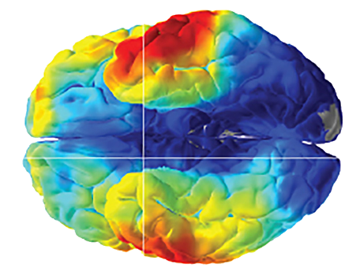
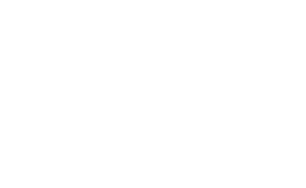

### Class #2

#### Fundamentos de Epidemiologia 2021


Francisco Pina Martins

[@FPinaMartins](https://twitter.com/FPinaMartins)

[@FPinaMartins@scholar.social](https://scholar.social/@FPinaMartins) (Fediverse)

---

### Epidemic Measurements

---

### Measurements memory refresher

* &shy;<!-- .element: class="fragment" -->Absolute
 * &shy;<!-- .element: class="fragment" -->Count data
* &shy;<!-- .element: class="fragment" -->Relative
 * &shy;<!-- .element: class="fragment" -->Proportion
 * &shy;<!-- .element: class="fragment" -->Ratio
 * &shy;<!-- .element: class="fragment" -->Rate

&shy;<!-- .element: class="fragment" -->

|||

### Relative measurements

* &shy;<!-- .element: class="fragment" -->Numerator is contained in denominator
&shy;<!-- .element: class="fragment" -->`$$ Proportion = \frac{Num. ♀  students}{Num. students} $$`
* &shy;<!-- .element: class="fragment" -->Numerator and denominator are independent
&shy;<!-- .element: class="fragment" -->`$$ Ratio = \frac{Num. ♀ students}{Num. ♂ students} $$`
* &shy;<!-- .element: class="fragment" -->Numerator is number of occurrences and denominator is time
&shy;<!-- .element: class="fragment" -->`$$ Rate = \frac{\text{Num. students enroled in MSc}}{\textrm{Num. years the MSc existed}} $$`

---

### Incidence Rate (IR)

<div style="float:left; width:70%;" class="fragment">

* In epidemiology *rate* frequently refers to *Incidence Rate*
  * (Numb. disease occurrences)/(Person-Year of risk exposure)
  * But what does this mean?

</div>

<div style="float:right; width:30%;" class="fragment">



</div>


<div style="float:left; width:100%;" class="fragment">

```R
# Total person-years in the study:
# Time "stops counting" whenever a subject is no longer "at risk"
TPY = 0.5 + 5 + 1.5 + 5 + 2.5  # 14.5

# The **rate** is cases/TPY:
IR = 3/TPY  # 0.207 cases/p-y (kind of meaningless)

# But... If we multiply by 1000:
# IR = 207 cases / 1000 p-y

```

* Assuming a representative sample, we can expect 207 cases/1000 persons each year, or, how fast new cases arise

</div>

---

### Cumulative Incidence (CI)

* &shy;<!-- .element: class="fragment" -->Subject's probability to become diseased:
&shy;<!-- .element: class="fragment" -->`$$ CI = \frac{Nct}{Prt} $$`
* &shy;<!-- .element: class="fragment" -->Where:
 * &shy;<!-- .element: class="fragment" -->*Nct* = Number of cases in time period *t*
 * &shy;<!-- .element: class="fragment" -->*Prt* = Population at risk at start of time period *t*
* &shy;<!-- .element: class="fragment" -->Effectively a risk estimate
* &shy;<!-- .element: class="fragment" -->Assumes the entire population was accompanied for 100% of *t*

|||

### CI example

```R
# Using data from the previous example
CI = 3/5

# Assuming a representative sample, we expect 3/5 individuals to develop this disease

```

---

### Prevalence

* &shy;<!-- .element: class="fragment" -->Subject probability of being diseased in any given moment
&shy;<!-- .element: class="fragment" -->`$$ P_t = \frac{C_t}{N_t} $$`
* &shy;<!-- .element: class="fragment" -->Where:
 * &shy;<!-- .element: class="fragment" -->*Ct* = Total number of cases at moment *t*
 * &shy;<!-- .element: class="fragment" -->*Nt* = Population at moment *t*
* &shy;<!-- .element: class="fragment" -->Single observation measure
* &shy;<!-- .element: class="fragment" -->Will vary a lot in time

|||

### Prevalence example

```R
# Data from previous example
# The prevalence by end of year 2

Prev = 2/5

```

---

### Case-fatality ratio

* &shy;<!-- .element: class="fragment" -->An estimate of the probability of dying from the studied disease
&shy;<!-- .element: class="fragment" -->`$$ Cf_r = \frac{N_D}{N_c} $$`
* &shy;<!-- .element: class="fragment" -->Where:
 * &shy;<!-- .element: class="fragment" -->*ND* = Number of deaths from disease
 * &shy;<!-- .element: class="fragment" -->*NC* = Number of disease cases
* &shy;<!-- .element: class="fragment" -->A measurement of disease's **risk**

|||

### Case-fatality ratio example

```R
# Of the 118,125,509 COVID-19 cases worldwide (09/03/2021)
# 2,620,424 resulted in the patient's death

CFr = 2620424/118125509  # 0.02218

# Roughly 2.2% of COVID-19 patients end up dying

```

---

### Odds

* &shy;<!-- .element: class="fragment" -->Ratio between an event of prob. *p* and it's complement of prob. (1-*p*)

&shy;<!-- .element: class="fragment" -->`$$ Odds = \frac{p}{1-p} $$`
* &shy;<!-- .element: class="fragment" -->Eg.: There are 25 frogs in a pond; five are yellow. The *odds* of picking a yellow frog at random are (5/25)/(20/25) = 5/20 = 1/4
 * &shy;<!-- .element: class="fragment" -->"The *odds* are 1:4"
 * &shy;<!-- .element: class="fragment" -->What are the *odds* of picking a green frog?

&shy;<!-- .element: class="fragment" -->

---

### Association measures

---

### Effect

* &shy;<!-- .element: class="fragment" -->One of epidemiological research goals is to establish a **causal relationship** between a **risk/protection** factor and an **outcome**
* &shy;<!-- .element: class="fragment" -->In order to establish a causal association, a control group is **required**

&shy;<!-- .element: class="fragment" -->

&shy;<!-- .element: class="fragment" -->`$$ E=exposed; \bar{E}=unexposed; D=diseased; \bar{D}=healthy $$`

---

## Risk Ratio (RR)

<div style="float:left; width:45%;">

* &shy;<!-- .element: class="fragment" data-fragment-index="1" -->Ratio between Exposed Risk and Unexposed Risk
* &shy;<!-- .element: class="fragment" data-fragment-index="2" -->rE: probability of becoming diseased, **if exposed**
* &shy;<!-- .element: class="fragment" data-fragment-index="2" -->rĒ: probability of becoming diseased, **if not exposed**
 *  &shy;<!-- .element: class="fragment" data-fragment-index="6" -->RR = 1: No risk association
 *  &shy;<!-- .element: class="fragment" data-fragment-index="6" -->RR > 1: Exposition is **risk** factor
 *  &shy;<!-- .element: class="fragment" data-fragment-index="6" -->RR < 1: Exposition is **protection** factor

</div>

<div style="float:right; width:55%;">

&shy;<!-- .element: class="fragment" data-fragment-index="3" -->

&shy;<!-- .element: class="fragment" data-fragment-index="4" -->`$$ r_E=\frac{a}{a+b}$$`
`$$ r_\bar{E}=\frac{c}{c+d} $$`

&shy;<!-- .element: class="fragment" data-fragment-index="5" -->`$$ RR=\frac{r_E}{r_\bar{E}}$$`

</div>

|||

### RR example

Incidence of *Mycobacterium tuberculosis* Infection Among Congregated, HIV-Infected Prison Inmates by Dormitory Wing — South Carolina, 1999


```R
# Calculate the RR if East Wing is exposed and West Wing is unexposed
Rexp = 28/157
RNexp = 4/137

RR = Rexp/RNexp  # 6.108 - East Wing inmates are 6.1x more likely to be infected than West Wing inmates

```

---

## Odds Ratio (OR)

<div style="float:left; width:45%;">

* &shy;<!-- .element: class="fragment" data-fragment-index="1" -->Are the odds of disease occurrence higher in exp. group than in unexp. group?
* &shy;<!-- .element: class="fragment" data-fragment-index="2" -->*p*E: probability of **becoming diseased**, if exposed
* &shy;<!-- .element: class="fragment" data-fragment-index="2" -->1-*p*E: probability of **not becoming diseased**, if exposed
 *  &shy;<!-- .element: class="fragment" data-fragment-index="6" -->OR = 1: No risk assoc.
 *  &shy;<!-- .element: class="fragment" data-fragment-index="6" -->OR > 1: Exp. is **risk** factor
 *  &shy;<!-- .element: class="fragment" data-fragment-index="6" -->OR < 1: Exp. is **protection** factor

</div>

<div style="float:right; width:55%;">

&shy;<!-- .element: class="fragment" data-fragment-index="3" -->

&shy;<!-- .element: class="fragment" data-fragment-index="4" -->`$$ o_E=\frac{\frac{a}{a+b}}{\frac{b}{a+b}}=\frac{a}{b}$$`
`$$ o_\bar{E}=\frac{\frac{c}{c+d}}{\frac{d}{c+d}}=\frac{c}{d}$$`

&shy;<!-- .element: class="fragment" data-fragment-index="5" -->`$$ OR=\frac{\frac{a}{b}}{\frac{c}{d}}=\frac{ad}{cb}$$`

</div>

|||

## OR example

Incidence of *Mycobacterium tuberculosis* Infection Among Congregated, HIV-Infected Prison Inmates by Dormitory Wing — South Carolina, 1999


```R
# Calculate the OR if East Wing is exposed and West Wing is unexposed
Oexp = 28/129
ONexp = 4/133

OR = Oexp/ONexp  # 7.217 - The odds of becoming diseased in East wing Vs. West wing are of 7.217:1


## Bonus - Is the OR significant??
Inmates = matrix(c(28,4,129,133), ncol=2)
fisher.test(Inmates)
```

---

## RR Vs. OR

* &shy;<!-- .element: class="fragment" -->*Risk* refers to the probability of occurrence of an event/**all possible events**
* &shy;<!-- .element: class="fragment" -->*Odds* refers to the probability of occurrence of an event/**probability of the event not occurring**

### &shy;<!-- .element: class="fragment" -->When should each be used?

* &shy;<!-- .element: class="fragment" -->*Risk* requires the use of “people at risk” as the denominator
 * &shy;<!-- .element: class="fragment" -->*Follow-up* studies
* &shy;<!-- .element: class="fragment" -->*Odds* does not require the "people at risk" variable
 * &shy;<!-- .element: class="fragment" -->*Case-control* studies

&shy;<!-- .element: class="fragment" -->[Would you like to know more?](https://www.ncbi.nlm.nih.gov/pmc/articles/PMC4640017/)


---

### Some key concepts

Concept of infection (replication of a foreign organism != disiese, the clinical symptoms experienced by the host)
Pathogens
Symptomatic and asymptomaic infection
Transmission
Correlation between symptoms and infectiousness
Infectious period
Resistant != susceptible

---

### Transmission

Infectious disieses
* direct 
  * Airborne (droplets, large and small)
  * Sexual (such as HIV)

* inderct (vector transmssion)
  * Intermediate carrier (objects (formite transmssion))
  * Waterborne transmission (like cholera)
  * vectorborne (mosquitos, flies, fleas, etc. (Malaria and dengue, plague))
* Breaking transmision chains

---

### Reproductive number

* How does it start?
  * One person must infectat least one
  * R0
  * Avg. number of secondary infections generated by the first infected individual in a population of completely susceptible individuals
* Understangin this pheneomenon helps prevent epidemics from starting, or limiting spread.

* What influences R0:
  * Time an individual is infectious (L, from length)
  * Number of susceptible hosts (S, for susceptible)
  * Transmissibility (Beta):
    * Rate of potentially transmissible ocntacts
    * How likely is a contact to result in transmission?
    * Depends on agent and population characteristics 
* R0 = S * L * Beta
  * Average!!!
* Useful for generalizing, but the start depends a lot on where and in whom an epidemic appears

---

### Epidemic curve

Epidemics are rare events

SIR compartmental framewok (Susceptible, Infected, Removed, over time)
Random meetings assumed (so all SIR types have random contact)

Chain of transmission!
Evolution of this chain depends on R0
Individuals go from susceptible to infected to removed
As susptible pool decreases, an increasing fration of contacts does not lead to new infections

R_E (Effective Reproductive) = R0 * %susceptible population
If R_E < 1 epidemic is self limiting
This happens when % susceptibles in pop falls below 1/R0 -> Herd Immunity

A fraction of the population remains susceptibe as the epidemic self limits itself: Exp(-R0)

Duration of the epidemic depends on:
* duration of infectious period
* latent period (time between being infected and infecting)

---

### References

[Person-year](https://sph.unc.edu/wp-content/uploads/sites/112/2015/07/nciph_ERIC4.pdf)
[Cumulative Incidence](https://sphweb.bumc.bu.edu/otlt/mph-modules/ep/ep713_diseasefrequency/ep713_diseasefrequency4.html)
[Disease prevalence](https://www.nimh.nih.gov/health/statistics/what-is-prevalence.shtml)
[Risk Ratio](https://www.cdc.gov/csels/dsepd/ss1978/lesson3/section5.html)
[RR Vs. OR](https://www.ncbi.nlm.nih.gov/pmc/articles/PMC4640017/)
