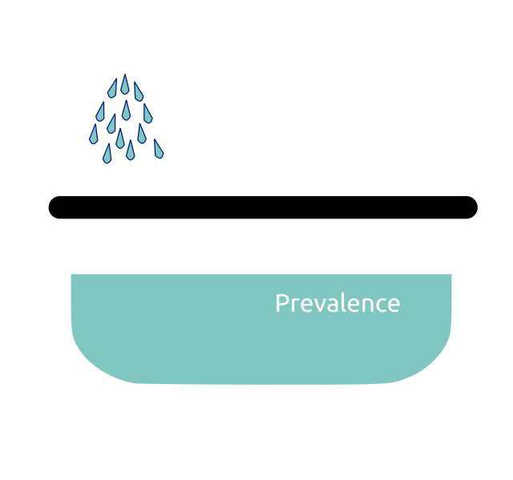
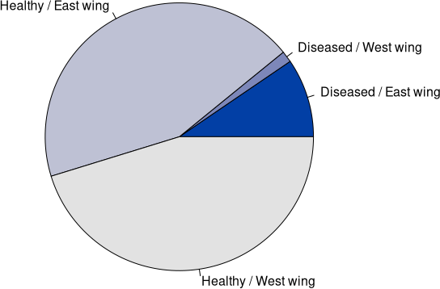
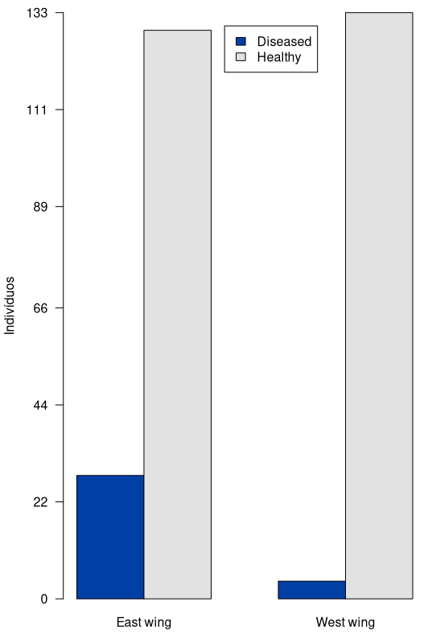
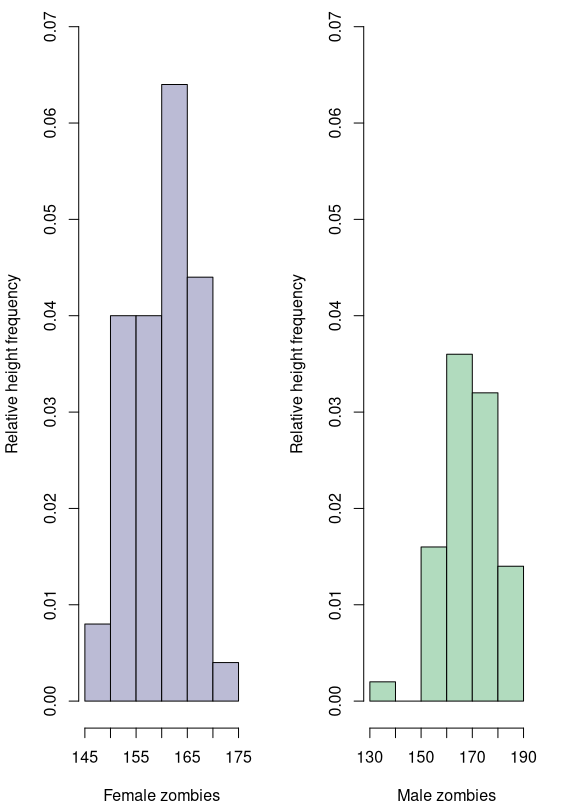
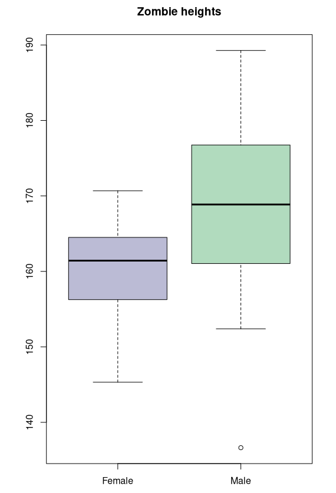
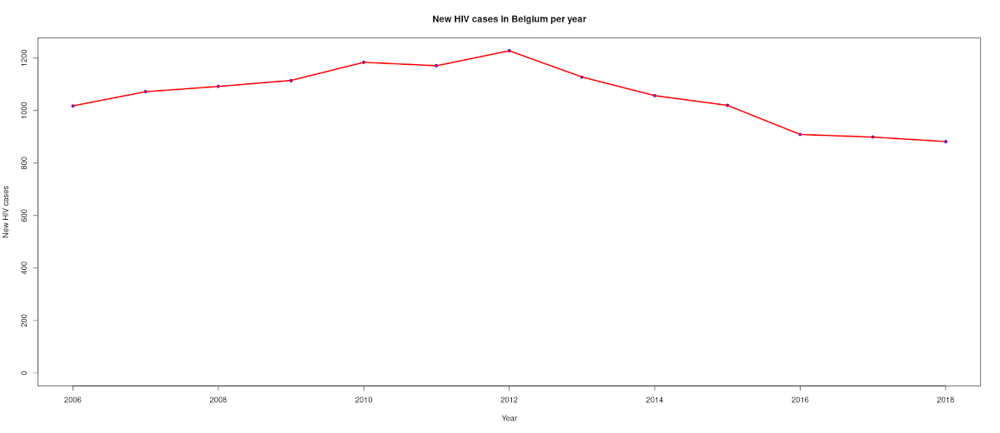
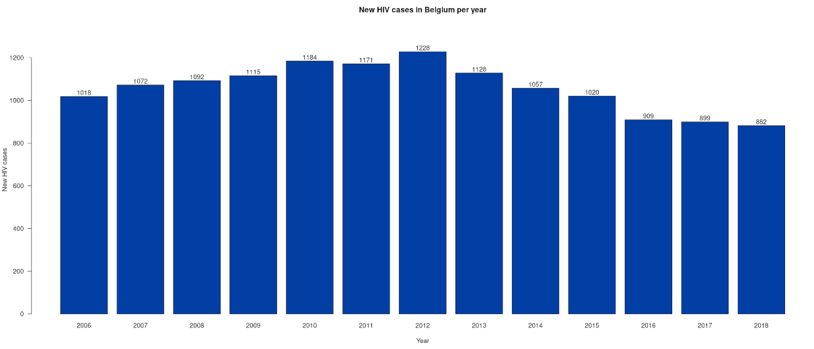

### Class #2

#### Fundamentos de Epidemiologia 2021


Francisco Pina Martins

[@FPinaMartins](https://twitter.com/FPinaMartins)

[@FPinaMartins@scholar.social](https://scholar.social/@FPinaMartins) (Fediverse)

---

### Epidemic Measurements

---

### Measurements memory refresher

* &shy;<!-- .element: class="fragment" -->Absolute
 * &shy;<!-- .element: class="fragment" -->Count data
* &shy;<!-- .element: class="fragment" -->Relative
 * &shy;<!-- .element: class="fragment" -->Proportion
 * &shy;<!-- .element: class="fragment" -->Ratio
 * &shy;<!-- .element: class="fragment" -->Rate

&shy;<!-- .element: class="fragment" -->

|||

### Relative measurements

* &shy;<!-- .element: class="fragment" -->Numerator is contained in denominator
&shy;<!-- .element: class="fragment" -->`$$ Proportion = \frac{Num. ♀  students}{Num. students} $$`
* &shy;<!-- .element: class="fragment" -->Numerator and denominator are independent
&shy;<!-- .element: class="fragment" -->`$$ Ratio = \frac{Num. ♀ students}{Num. ♂ students} $$`
* &shy;<!-- .element: class="fragment" -->Numerator is number of occurrences and denominator is time
&shy;<!-- .element: class="fragment" -->`$$ Rate = \frac{\text{Num. students enroled in MSc}}{\textrm{Num. years the MSc existed}} $$`

---

### Incidence Rate (IR)

<div style="float:left; width:70%;" class="fragment">

* Num. new cases per risk period time unit
`$$ IR = \frac{N_c}{\sum {R_p}[person-time]} $$`

</div>


<div style="float:right; width:30%;" class="fragment">


<!-- Not in markdown syntax to remove padding-->

</div>

<div style="float:left; width:100%;" class="fragment">

* *N<sub>c</sub>* = Num. new cases in a given time period
* *R<sub>p</sub>* = Time period during which a subject was considered at risk

</div>

<div style="float:left; width:100%;" class="fragment">

```R
# Total person-years in the study:
# Time "stops counting" whenever a subject is no longer "at risk"
TPY = 0.5 + 5 + 1.5 + 5 + 2.5  # 14.5
# The **rate** is cases/TPY:
IR = 3/TPY  # 0.207 cases/p-y (kind of meaningless)
# But... If we multiply by 1000:
# IR = 207 cases / 1000 p-y
```

* Assuming a representative sample, we can expect 207 cases/1000 persons each year, or, how fast new cases arise

</div>

---

### Cumulative Incidence (CuI)

* &shy;<!-- .element: class="fragment" -->Subject's probability to become diseased:
&shy;<!-- .element: class="fragment" -->`$$ CuI = \frac{Nct}{Prt} $$`
* &shy;<!-- .element: class="fragment" -->Where:
 * &shy;<!-- .element: class="fragment" -->*N<sub>ct</sub>* = Number of cases in time period *t*
 * &shy;<!-- .element: class="fragment" -->*P<sub>rt</sub>* = Population at risk at start of time period *t*
* &shy;<!-- .element: class="fragment" -->Effectively a risk estimate
* &shy;<!-- .element: class="fragment" -->Assumes the entire population was accompanied for 100% of *t*

|||

### CI example


```R
# Using data from the previous example
CuI = 3/5

# Assuming a representative sample, we expect 3/5 individuals to develop this disease

```

---

### Prevalence

* &shy;<!-- .element: class="fragment" -->Subject probability of being diseased in any given moment
&shy;<!-- .element: class="fragment" -->`$$ P_t = \frac{C_t}{N_t} $$`
* &shy;<!-- .element: class="fragment" -->Where:
 * &shy;<!-- .element: class="fragment" -->*C<sub>t</sub>* = Total number of cases at moment *t*
 * &shy;<!-- .element: class="fragment" -->*N<sub>t</sub>* = Population at moment *t*
* &shy;<!-- .element: class="fragment" -->Single observation measure
* &shy;<!-- .element: class="fragment" -->Will vary a lot in time

|||

### Prevalence example


```R
# Data from previous example
# The prevalence by end of year 2

Prev = 2/5

```

---

### Case-fatality ratio

* &shy;<!-- .element: class="fragment" -->An estimate of the probability of dying from the studied disease
&shy;<!-- .element: class="fragment" -->`$$ Cf_r = \frac{N_D}{N_c} $$`
* &shy;<!-- .element: class="fragment" -->*N<sub>D</sub>* = Number of deaths from disease
* &shy;<!-- .element: class="fragment" -->*N<sub>C</sub>* = Number of disease cases
* &shy;<!-- .element: class="fragment" -->A measurement of disease's **risk**

|||

### Case-fatality ratio example

```R
# Of the 118,125,509 COVID-19 cases worldwide (09/03/2021)
# 2,620,424 resulted in the patient's death

Cfr = 2620424/118125509  # 0.02218

# Roughly 2.2% of COVID-19 patients end up dying
```

---

### Epidemiologit's bathtub

&shy;<!-- .element: class="fragment" -->

---

### Odds

* &shy;<!-- .element: class="fragment" -->Ratio between an event of prob. *p* and it's complement (1-*p*)

&shy;<!-- .element: class="fragment" -->`$$ Odds = \frac{p}{1-p} $$`
* &shy;<!-- .element: class="fragment" -->Eg.: There are 25 frogs in a pond; five are yellow. The *odds* of picking a yellow frog at random are (5/25)/(20/25) = 5/20 = 1/4
 * &shy;<!-- .element: class="fragment" -->"The *odds* are 1:4"
 * &shy;<!-- .element: class="fragment" -->What are the *odds* of picking a green frog?

&shy;<!-- .element: class="fragment" -->

---

### Association measures

---

### Effect

* &shy;<!-- .element: class="fragment" -->One of epidemiological research goals is to establish a **causal relationship** between a **risk/protection** factor and an **outcome**
* &shy;<!-- .element: class="fragment" -->In order to establish a causal association, a control group is **required**

&shy;<!-- .element: class="fragment" -->

&shy;<!-- .element: class="fragment" -->`$$ E=exposed; \bar{E}=unexposed; D=diseased; \bar{D}=healthy $$`

---

### Risk Ratio (RR)

<div style="float:left; width:45%;">

* &shy;<!-- .element: class="fragment" data-fragment-index="1" -->Ratio between Exposed Risk and Unexposed Risk
* &shy;<!-- .element: class="fragment" data-fragment-index="2" -->r<sub>E</sub>: probability of becoming diseased, **if exposed**
* &shy;<!-- .element: class="fragment" data-fragment-index="2" -->r<sub>Ē</sub>: probability of becoming diseased, **if not exposed**
 *  &shy;<!-- .element: class="fragment" data-fragment-index="6" -->RR = 1: No risk association
 *  &shy;<!-- .element: class="fragment" data-fragment-index="6" -->RR > 1: Exposition is **risk** factor
 *  &shy;<!-- .element: class="fragment" data-fragment-index="6" -->RR < 1: Exposition is **protection** factor

</div>

<div style="float:right; width:55%;">

&shy;<!-- .element: class="fragment" data-fragment-index="3" -->

&shy;<!-- .element: class="fragment" data-fragment-index="4" -->`$$ r_E=\frac{a}{a+b} \;\;\;\; r_\bar{E}=\frac{c}{c+d} $$`

&shy;<!-- .element: class="fragment" data-fragment-index="5" -->`$$ RR=\frac{r_E}{r_\bar{E}}$$`

</div>

|||

### RR example

Incidence of *Mycobacterium tuberculosis* Infection Among Congregated, HIV-Infected Prison Inmates by Dormitory Wing — South Carolina, 1999


```R
# Calculate the RR if East Wing is exposed and West Wing is unexposed
Rexp = 28/157
RNexp = 4/137

RR = Rexp/RNexp  # 6.108 - East Wing inmates are 6.1x more likely to be infected than West Wing inmates

```

---

### Risk Difference (RD)

* &shy;<!-- .element: class="fragment" -->Difference in risk between two groups
* &shy;<!-- .element: class="fragment" -->How much **excess risk** is due to exposure of interest
 * &shy;<!-- .element: class="fragment" -->RD > 0: excess risk due to exposure
 * &shy;<!-- .element: class="fragment" -->RD < 0: exposure of interest has a protective effect

&shy;<!-- .element: class="fragment" -->`$$ RD = \frac{C_E}{N_E} - \frac{C_\bar{E}}{N_\bar{E}} $$`

* &shy;<!-- .element: class="fragment" -->C<sub>E</sub> = Cases in exposed group
* &shy;<!-- .element: class="fragment" -->N<sub>E</sub> = Total subjects in exposed group
* &shy;<!-- .element: class="fragment" -->C<sub>Ē</sub> = Cases in unexposed group
* &shy;<!-- .element: class="fragment" -->N<sub>Ē</sub> = Total subjects in unexposed group

---

### Odds Ratio (OR)

<div style="float:left; width:45%;">

* &shy;<!-- .element: class="fragment" data-fragment-index="1" -->Are the odds of disease occurrence higher in exp. group than in unexp. group?
* &shy;<!-- .element: class="fragment" data-fragment-index="2" -->*p*E: probability of **becoming diseased**, if exposed
* &shy;<!-- .element: class="fragment" data-fragment-index="2" -->1-*p*E: probability of **not becoming diseased**, if exposed
 *  &shy;<!-- .element: class="fragment" data-fragment-index="6" -->OR = 1: No risk assoc.
 *  &shy;<!-- .element: class="fragment" data-fragment-index="6" -->OR > 1: Exp. is **risk** factor
 *  &shy;<!-- .element: class="fragment" data-fragment-index="6" -->OR < 1: Exp. is **protection** factor

</div>

<div style="float:right; width:55%;">

&shy;<!-- .element: class="fragment" data-fragment-index="3" -->

&shy;<!-- .element: class="fragment" data-fragment-index="4" -->`$$ o_E=\frac{\frac{a}{a+b}}{\frac{b}{a+b}}=\frac{a}{b} \;\;\;\;\; o_\bar{E}=\frac{\frac{c}{c+d}}{\frac{d}{c+d}}=\frac{c}{d}$$`

&shy;<!-- .element: class="fragment" data-fragment-index="5" -->`$$ OR=\frac{\frac{a}{b}}{\frac{c}{d}}=\frac{ad}{cb}$$`

</div>

|||

### OR example

Incidence of *Mycobacterium tuberculosis* Infection Among Congregated, HIV-Infected Prison Inmates by Dormitory Wing — South Carolina, 1999


```R
# Calculate the OR if East Wing is exposed and West Wing is unexposed
Oexp = 28/129
ONexp = 4/133

OR = Oexp/ONexp  # 7.217 - The odds of becoming diseased in East wing Vs. West wing are of 7.217:1


## Bonus - Is the OR significant??
Inmates = matrix(c(28,4,129,133), ncol=2)
fisher.test(Inmates)
```

---

### RR Vs. OR

* &shy;<!-- .element: class="fragment" -->*Risk* refers to the probability of occurrence of an event/**all possible events**
* &shy;<!-- .element: class="fragment" -->*Odds* refers to the probability of occurrence of an event/**probability of the event not occurring**

### &shy;<!-- .element: class="fragment" -->When should each be used?

* &shy;<!-- .element: class="fragment" -->*Risk* requires the use of “people at risk” as the denominator
 * &shy;<!-- .element: class="fragment" -->*Follow-up* studies
* &shy;<!-- .element: class="fragment" -->*Odds* does not require the "people at risk" variable
 * &shy;<!-- .element: class="fragment" -->*Case-control* studies

&shy;<!-- .element: class="fragment" -->[Would you like to know more?](https://www.ncbi.nlm.nih.gov/pmc/articles/PMC4640017/)

---

### Rate Ratio (RaR)

* &shy;<!-- .element: class="fragment" -->When IR is computed, it is possible to compare the rates between *exposed* (*E*) and *unexposed* (*Ē*) subjects
* &shy;<!-- .element: class="fragment" -->RaR = R<sub>*E*</sub>/R<sub>*Ē*</sub>

<div class="fragment">

|       | D   | ND  | Person-years at risk |
|:---   |:---:|:---:|:---:                 |
| E     | 60  | 140 | 175                  |
| Ē     | 25  | 175 | 188                  |
| Total | 85  | 315 | 363                  |

</div>

* &shy;<!-- .element: class="fragment" -->R<sub>exposed</sub> = 60/175 = 0.34
* &shy;<!-- .element: class="fragment" -->R<sub>unexposed</sub> = 25/188 = 0.13
 * &shy;<!-- .element: class="fragment" -->RaR = 0.34/0.13 = 2.6
* &shy;<!-- .element: class="fragment" -->"The outcome develops 2.6x faster in *E* subjects than in *Ē*"

---

### Plotting (again) & other tricks

---

### Frequency data

* Let's get back to our tuberculosis table


|||

### Pie chart

<div style="float:right; width:35%;">



[Picking colours](https://www.nceas.ucsb.edu/sites/default/files/2020-04/colorPaletteCheatsheet.pdf)

</div>

<div style="float:left; width:65%;">

```R
library(colorspace)

# Fisrt let's create our table:
tub_table = matrix(c(28, 129, 4, 133), nrow=2, byrow=T)
colnames(tub_table) = c("Diseased", "Healthy")
rownames(tub_table) = c("East wing", "West wing")

print(tub_table)

rel_tub_table = proportions(tub_table, 1)  # Notice the "margin" argument!

print(rel_tub_table)

pie(tub_table, col=sequential_hcl(4), 
    labels=c(paste(colnames(tub_table)[1],"/",rownames(tub_table)[1]),
             paste(colnames(tub_table)[1],"/",rownames(tub_table)[2]),
             paste(colnames(tub_table)[2],"/",rownames(tub_table)[1]),
             paste(colnames(tub_table)[2],"/",rownames(tub_table)[2])))

```
</div>

|||

### Bar plot

<div style="float:right; width:35%;">



[Picking colours](https://www.nceas.ucsb.edu/sites/default/files/2020-04/colorPaletteCheatsheet.pdf)

</div>

<div style="float:left; width:65%;">

```R
library(colorspace)

tub_table = matrix(c(28, 129, 4, 133), nrow=2, byrow=T)
colnames(tub_table) = c("Diseased", "Healthy")
rownames(tub_table) = c("East wing", "West wing")

print(tub_table)

rel_tub_table = proportions(tub_table, 1)  # Notice the "margin" argument!

print(rel_tub_table)

barplot(t(tub_table), beside=T, col=sequential_hcl(2),
        ylim=c(0, max(tub_table)), ylab="Indivíduos", axes=F)

axis(2, at=round(seq(0, max(tub_table), length.out=7), 0), las=1)

legend(3.2, 130 , colnames(tub_table), fill=sequential_hcl(2))     

```
</div>

---

### Quantitative data

* &shy;<!-- .element: class="fragment" -->This time we will generate some data!
* &shy;<!-- .element: class="fragment" -->What is an epidemiology course without zombies?
* &shy;<!-- .element: class="fragment" -->Let's generate some! (heights)

<div style="float:right; width:35%;" class="fragment">


</div>

<div style="float:left; width:65%;" class="fragment">


```R
set.seed(1235813)

# Draw 'random' values from a normal distribution
Fz = rnorm(50, 160, 6)
Mz = rnorm(50, 170, 9)

# Tidy it up in a dataframe
Zdata = data.frame(Fz, Mz)

# First look at our zombie heights
summary(Zdata)

```

</div>

|||

### Histograms

<div style="float:left; width:65%;" class="fragment">

```R
par(mfrow=c(1,2))  # Draw plots on 1 row and 2 columns

# Make sure the limits are comparable on both plots
hist(Fz, right=FALSE, prob=T, col="#bbbbd5", main="",
       xlab=" ", ylab="Relative height frequency", ylim=c(0, 0.07))
mtext("Female zombies",side=1,line=3)

hist(Mz, right=FALSE, prob=T, col="#b1dbbe", main=" ",
         xlab=" ", ylab="Relative height frequency", ylim=c(0,0.07))
mtext("Male zombies",side=1,line=3)

# Clean up after our mess
par(mfrow=c(1,1))
```

</div>

<div style="float:right; width:35%;" class="fragment">



</div>

|||

### Boxplots

<div style="float:right; width:35%;" class="fragment">



</div>

<div style="float:left; width:65%;" class="fragment">

```R
# Just like that!
boxplot(Zdata, col=c("#bbbbd5", "#b1dbbe"),
        names=c("Female","Male"), main="Zombie heights")

```


</div>

---

### Time series

* &shy;<!-- .element: class="fragment" -->When our data is distributed along time, we need to show some continuity
 * &shy;<!-- .element: class="fragment" -->The best solution depends on what we want to highlight:
  * &shy;<!-- .element: class="fragment" -->Trend (line plot)
  * &shy;<!-- .element: class="fragment" -->Individual values (bar plot)
* &shy;<!-- .element: class="fragment" -->But first let's obtain some data to plot

<div class="fragment">

```R
# Number of new HIV cases in belgium from 2006-2018
# https://www.statista.com/statistics/645541/new-hiv-cases-diagnosed-belgium/

cases = c(1018, 1072, 1092, 1115, 1184, 1171, 1228, 1128, 1057, 1020, 909, 899, 882)
years = c(2006:2018)

HIV = data.frame(years, cases)
```

</div>


|||

### Line plot

```R
plot(HIV[,"years"], HIV[,"cases"], pch=16, col="blue", xlab="Year",
     ylab="New HIV cases", ylim=c(0, max(HIV["cases"])),
     main="New HIV cases in Belgium per year")
lines(HIV[,"years"], HIV[,"cases"], col="red", lwd=3)
```



|||

### Bar plot

```R
p = barplot(cases, col=sequential_hcl(1), xlab="Year",
     ylab="New HIV cases", ylim=c(0, max(HIV["cases"]) * 1.1),
     main="New HIV cases in Belgium per year",
     names.arg=years, las=T)
text(p, cases + 18, labels=cases)
```



---

### References

* [Person-year](https://sph.unc.edu/wp-content/uploads/sites/112/2015/07/nciph_ERIC4.pdf)
* [Cumulative Incidence](https://sphweb.bumc.bu.edu/otlt/mph-modules/ep/ep713_diseasefrequency/ep713_diseasefrequency4.html)
* [Disease prevalence](https://www.nimh.nih.gov/health/statistics/what-is-prevalence.shtml)
* [Risk Ratio](https://www.cdc.gov/csels/dsepd/ss1978/lesson3/section5.html)
* [RR Vs. OR](https://www.ncbi.nlm.nih.gov/pmc/articles/PMC4640017/)
* [Case-control examples](https://sph.unc.edu/wp-content/uploads/sites/112/2015/07/nciph_ERIC5.pdf)
* [Rate Ratios](https://sph.unc.edu/wp-content/uploads/sites/112/2015/07/nciph_ERIC7.pdf)
