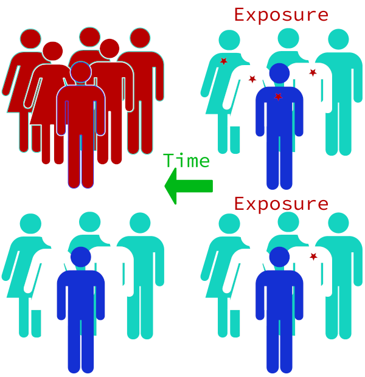
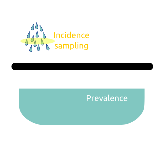
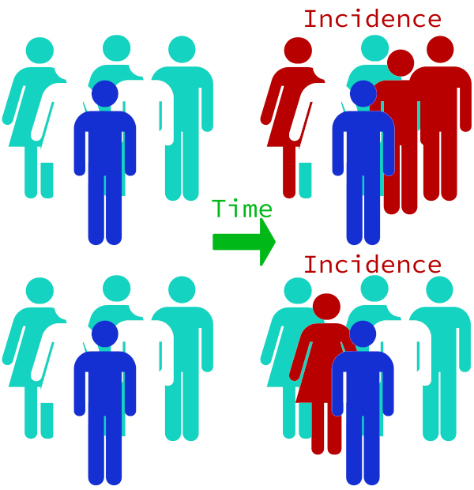
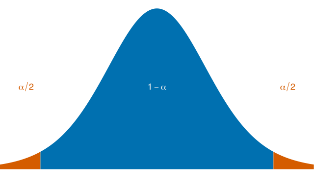

### Class #3

#### Fundamentos de Epidemiologia 2021


Francisco Pina Martins

[@FPinaMartins](https://twitter.com/FPinaMartins)

[@FPinaMartins@scholar.social](https://scholar.social/@FPinaMartins) (Fediverse)

---

### In depth: Case-control studies

---

### When are they useful?

* &shy;<!-- .element: class="fragment" -->Associate exposure to an outcome
* &shy;<!-- .element: class="fragment" -->Go from effect to cause
* &shy;<!-- .element: class="fragment" -->Assess if exposure is equivalently distributed between cases and controls
* &shy;<!-- .element: class="fragment" -->**Is exposure a risk factor for the outcome?**
* &shy;<!-- .element: class="fragment" -->Especially useful for rare diseases

---

### Study design

* &shy;<!-- .element: class="fragment" -->Propose a hypothesis that links an outcome to an exposure
* &shy;<!-- .element: class="fragment" -->Select a population to study
* &shy;<!-- .element: class="fragment" -->Form one group of subjects exhibiting the outcome (cases)
* &shy;<!-- .element: class="fragment" -->Form another group of subjects not exhibiting the outcome (controls)
* &shy;<!-- .element: class="fragment" -->Compare exposure data proportions

|||



---

### Data processing

* &shy;<!-- .element: class="fragment" -->Case-control studies data is typically organized in 2X2 tables:

&shy;<!-- .element: class="fragment" -->

* &shy;<!-- .element: class="fragment" -->Data from these tables is then used to calculate:
 * &shy;<!-- .element: class="fragment" -->~~Risk Ratio~~
 * &shy;<!-- .element: class="fragment" -->Odds Ratio
* &shy;<!-- .element: class="fragment" -->Controls are representative of **a sample** of the population-at-risk
 * &shy;<!-- .element: class="fragment" -->Risk measure denominator (population-at-risk) is unknown
* &shy;<!-- .element: class="fragment" -->Number of cases and controls are set during design phase
 * &shy;<!-- .element: class="fragment" -->Ratio of controls to cases is not biologically meaningful

---

### Types of case-control studies

* &shy;<!-- .element: class="fragment" -->Case-control studies can be categorized:
 * &shy;<!-- .element: class="fragment" -->When cases develop outcome
 * &shy;<!-- .element: class="fragment" -->How controls are sampled

|||

### Depending on outcome development

<div style="float:left; width:50%;" class="fragment">

#### Prevalence studies

* &shy;<!-- .element: class="fragment" -->Subjects **were existing outcome cases** during observation period
* &shy;<!-- .element: class="fragment" -->Preferred if studying disease duration

</div>

<div style="float:Right; width:50%;" class="fragment">

#### Incidence studies

* &shy;<!-- .element: class="fragment" -->Subjects who **newly develop** the outcome during the observation period
* &shy;<!-- .element: class="fragment" -->Preferred if studying disease causes

</div>

&shy;<!-- .element: class="fragment" -->

---

### Controls selection

* &shy;<!-- .element: class="fragment" -->One of the hardest problems in Case-control studies
* &shy;<!-- .element: class="fragment" -->Three most frequent approaches:
 1. &shy;<!-- .element: class="fragment" -->Base or case-base sampling
 2. &shy;<!-- .element: class="fragment" -->Cumulative density or survivor sampling
 3. &shy;<!-- .element: class="fragment" -->Incidence density or risk set sampling

&shy;<!-- .element: class="fragment" -->

|||

### Base or case-base sampling

* &shy;<!-- .element: class="fragment" -->Controls selected from the source population
 * &shy;<!-- .element: class="fragment" -->Every subject has the same inclusion chance
* &shy;<!-- .element: class="fragment" -->Requires a previously defined cohort
* &shy;<!-- .element: class="fragment" -->Controls selected after cases are observed
* &shy;<!-- .element: class="fragment" -->OR provides a valid estimate for RR

&shy;<!-- .element: class="fragment" -->

|||

### Cumulative density or survivor sampling

* &shy;<!-- .element: class="fragment" -->Controls are sampled from subjects without the outcome
 * &shy;<!-- .element: class="fragment" -->Not every subject can be included
* &shy;<!-- .element: class="fragment" -->Controls cannot ever become cases
* &shy;<!-- .element: class="fragment" -->Controls selected after cases are observed
* &shy;<!-- .element: class="fragment" -->OR estimates the RR only if outcome is rare

&shy;<!-- .element: class="fragment" -->

|||

### Incidence density or risk set sampling

* &shy;<!-- .element: class="fragment" -->Cases are incident cases
* &shy;<!-- .element: class="fragment" -->Controls are selected from population at the same time cases occur 
 * &shy;<!-- .element: class="fragment" -->Controls can become cases if outcome manifests during the study
* &shy;<!-- .element: class="fragment" -->OR provides a valid estimate for RR
* &shy;<!-- .element: class="fragment" -->Estimates are not biased by differential loss to follow up
 * &shy;<!-- .element: class="fragment" -->Exposed subjects leaving the population do not cause bias

&shy;<!-- .element: class="fragment" -->

---

### Source populations

* &shy;<!-- .element: class="fragment" -->Should be restricted to a population of particular interest
 * &shy;<!-- .element: class="fragment" -->E.g. [Serum carotenoids protect against cervical intraepithelial neoplasia](https://cebp.aacrjournals.org/content/10/11/1219.long) (Southwestern American Indian women)
 * &shy;<!-- .element: class="fragment" -->Avoid confounders
 * &shy;<!-- .element: class="fragment" -->The more specific the group, the less generalizable the conclusions
* &shy;<!-- .element: class="fragment" -->Controls should represent the restricted source population from which cases arise, not the total population
* &shy;<!-- .element: class="fragment" -->Cases do not have to include all cases in the total population

|||

<div style="float:left; width:30%;" class="fragment">

### Sourcing cases

* &shy;<!-- .element: class="fragment" -->Hospital diagnosis
* &shy;<!-- .element: class="fragment" -->Disease registries
* &shy;<!-- .element: class="fragment" -->Mass screenings
* &shy;<!-- .element: class="fragment" -->As a follow-up to a follow-up study

</div>

<div style="float:right; width:70%;" class="fragment">

### Sourcing controls

1. &shy;<!-- .element: class="fragment" -->Random sampling from census block groups
2. &shy;<!-- .element: class="fragment" -->Case's close contacts
 * &shy;<!-- .element: class="fragment" -->Unless shared exposure of interest
3. &shy;<!-- .element: class="fragment" -->Hospital controls
 * &shy;<!-- .element: class="fragment" -->May not be from same population
 * &shy;<!-- .element: class="fragment" -->May not be representative of exposure
 * &shy;<!-- .element: class="fragment" -->Other diseases may cause confounding
4. &shy;<!-- .element: class="fragment" -->Controls with other diseases
 * &shy;<!-- .element: class="fragment" -->Must be sure to exclude possible related diseases

</div>

---

### Pros and cons

<div style="float:left; width:50%;" class="fragment">

### Pros

* &shy;<!-- .element: class="fragment" -->Can work with small sample
* &shy;<!-- .element: class="fragment" -->No need to follow subjects over time
* &shy;<!-- .element: class="fragment" -->OR is a reasonably good RR estimate
* &shy;<!-- .element: class="fragment" -->Inexpensive
* &shy;<!-- .element: class="fragment" -->Can study multiple risk factors simultaneously
* &shy;<!-- .element: class="fragment" -->Can provide reasonable support for causation

</div>

<div style="float:right; width:50%;" class="fragment">

### Cons

* &shy;<!-- .element: class="fragment" -->Cannot estimate RR (only approximate via OR)
* &shy;<!-- .element: class="fragment" -->Can suffer from recall bias
 * &shy;<!-- .element: class="fragment" -->Unless based on historical records
* &shy;<!-- .element: class="fragment" -->Choosing sources can prove difficult
* &shy;<!-- .element: class="fragment" -->Not efficient for studying rare exposures
* &shy;<!-- .element: class="fragment" -->Frequently not generalizable

</div>

---

### In depth: Follow-up studies

---

### What is a follow-up study?

* &shy;<!-- .element: class="fragment" -->AKA *cohort study*
 * &shy;<!-- .element: class="fragment" -->A group of subjects with a common characteristic
* &shy;<!-- .element: class="fragment" -->Followed for a time period
* &shy;<!-- .element: class="fragment" -->Compare exposed and unexposed subjects
* &shy;<!-- .element: class="fragment" -->How many reach an outcome of interest
 * &shy;<!-- .element: class="fragment" -->Assert if exposure is associated with outcome

|||



|||

### Cocoa enriched example

**Assert if chocolate consumption protects from common cold**

* &shy;<!-- .element: class="fragment" -->Exposure - eating chocolate
* &shy;<!-- .element: class="fragment" -->Outcome - catching a cold

</br>
</br>

<div class="fragment" style="float:left;width=50%;">


</div>

<div class="fragment" style="float:right;width=50%;">


</div>

---

### Cohort establishment

* &shy;<!-- .element: class="fragment" -->Can be based on any common characteristic:
 * &shy;<!-- .element: class="fragment" -->Zip code
 * &shy;<!-- .element: class="fragment" -->Education
 * &shy;<!-- .element: class="fragment" -->Age
 * &shy;<!-- .element: class="fragment" -->Agent exposure
  * &shy;<!-- .element: class="fragment" -->Can be known at baseline (Eg. Coffee drinkers Vs. Non drinkers)
  * &shy;<!-- .element: class="fragment" -->Can be divided in multiple categories (Eg. How many coffee cups consumed per day)
* &shy;<!-- .element: class="fragment" -->Determine follow-up period

|||

### Cocoa enriched example

* &shy;<!-- .element: class="fragment" -->Select a sample representative of the population
* &shy;<!-- .element: class="fragment" -->Follow subjects for 1 year

&shy;<!-- .element: class="fragment" -->

---

### After baseline

* &shy;<!-- .element: class="fragment" -->Once a cohort is selected:
 * &shy;<!-- .element: class="fragment" -->Exposures of interest are identified
 * &shy;<!-- .element: class="fragment" -->Outcomes of interest found at baseline are reason for exclusion
 * &shy;<!-- .element: class="fragment" -->All cohort members are at risk of developing the outcome
* &shy;<!-- .element: class="fragment" -->Outcome occurrences are recorded as time goes by

&shy;<!-- .element: class="fragment" -->

|||

### Cocoa enriched example

* &shy;<!-- .element: class="fragment" -->Identify who eats chocolate (eventually quantify)
* &shy;<!-- .element: class="fragment" -->Find any subjects who are already ill at the start and exclude them
* &shy;<!-- .element: class="fragment" -->Register anyone who catches a cold during the study period

---

### Results evaluation

* &shy;<!-- .element: class="fragment" -->Count the number of outcome occurrences
 * &shy;<!-- .element: class="fragment" -->**Cumulative Incidence**
* &shy;<!-- .element: class="fragment" -->Number of persons at study start is the **Relative Risk** denominator
* &shy;<!-- .element: class="fragment" -->Two risks are compared to obtain a **Risk Ratio** or **Risk Difference**
 * &shy;<!-- .element: class="fragment" -->Exposed
 * &shy;<!-- .element: class="fragment" -->Unexposed
* &shy;<!-- .element: class="fragment" -->Calculate **Incidence Rate**
 * &shy;<!-- .element: class="fragment" -->**Incidence Rate Ratio** is used to compare groups

|||

### Cocoa enriched example

* &shy;<!-- .element: class="fragment" -->How many **chocolate eaters** caught colds along the year
* &shy;<!-- .element: class="fragment" -->How many **chocolate non-eaters** caught colds along the year
 * &shy;<!-- .element: class="fragment" -->Calculate Risk Ratio and Risk Difference
* &shy;<!-- .element: class="fragment" -->Interpret results

&shy;<!-- .element: class="fragment" -->

---

### Pros and cons

<div style="float:left; width:50%;" class="fragment">

### Pros

* &shy;<!-- .element: class="fragment" -->Can directly measure **Risk**
* &shy;<!-- .element: class="fragment" -->Efficient for studying rare **exposures**
* &shy;<!-- .element: class="fragment" -->Can assess multiple outcomes from same exposure
* &shy;<!-- .element: class="fragment" -->Can establish temporal relationships between exposure and outcome
* &shy;<!-- .element: class="fragment" -->No recall bias
* &shy;<!-- .element: class="fragment" -->Generalizable

</div>

<div style="float:right; width:50%;" class="fragment">

### Cons

* &shy;<!-- .element: class="fragment" -->Large samples required
 * &shy;<!-- .element: class="fragment" -->*Especially* on rare outcomes
* &shy;<!-- .element: class="fragment" -->Expensive
 * &shy;<!-- .element: class="fragment" -->Time
 * &shy;<!-- .element: class="fragment" -->Money
* &shy;<!-- .element: class="fragment" -->Can suffer losses (individuals drop out of study) which may cause bias
* &shy;<!-- .element: class="fragment" -->Unaccounted differences between cohorts may introduce bias

</div>

---

### Confidence intervals (CI)

---

### What's in a CI?

* &shy;<!-- .element: class="fragment" -->**CIs** use the **sample** to estimate a range that likely contains **the population's true value**
 * &shy;<!-- .element: class="fragment" -->Eg. For a **95%** reliable study, a CI of **36-41** means:
  * &shy;<!-- .element: class="fragment" -->If study is repeated, re-sampling the whole population, the results would be between **36 and 41**, **95%** of the time
* &shy;<!-- .element: class="fragment" -->Is very influenced by sample size

&shy;<!-- .element: class="fragment" -->

---

### Risk assessment CI

* &shy;<!-- .element: class="fragment" -->One way to estimate the CI for risk is this:

&shy;<!-- .element: class="fragment" -->`$$ \left( r-z_{1-\alpha/2} \sqrt{\frac{r(1-r)}{n}}, r + z_{1-\alpha/2} \sqrt{\frac{r(1-r)}{n}} \right) $$`

* &shy;<!-- .element: class="fragment" -->Where:
 * &shy;<!-- .element: class="fragment" -->*r* = risk estimate
 * &shy;<!-- .element: class="fragment" -->*n* = total number of individuals used to estimate *r*

|||

### Example CI calculation

|           |  Stroke | No Stroke | Total|
| :----     |:----:|:------:|:----:|
| Smoker    | 31   |  1386  | 1471 |
| Non-Smoker| 15   |  1883  | 1898 |
| Total     | 46   |  3269  | 3315 |

* &shy;<!-- .element: class="fragment" -->Risk of Stroke death = 46/3315 = 0.013876
* &shy;<!-- .element: class="fragment" -->Smoker's risk of Stroke death = 31/1417 = 0.021877
* &shy;<!-- .element: class="fragment" -->Non-Smoker's risk of Stroke death = 15/1898 = 0.007903

|||

### Example CI calculation

* &shy;<!-- .element: class="fragment" -->CI for smokers (95% confidence)

&shy;<!-- .element: class="fragment" -->`$$ \left( 0.021877 \pm 1.96 \sqrt{\frac{0.021877(1-0.21877)}{1417}} \right) = (0.01426, 0.02949) $$`

* &shy;<!-- .element: class="fragment" -->We can be 95% sure that the interval (0.0143, 0.0295) contains the true risk value of smokers dying of Stroke

---

### Automate away!

* &shy;<!-- .element: class="fragment" -->Naturally, R will come to the rescue
* &shy;<!-- .element: class="fragment" -->Using the function `binom.approx()` from the package `epitools`
 * &shy;<!-- .element: class="fragment" -->3 arguments:
  * &shy;<!-- .element: class="fragment" -->Number of successes
  * &shy;<!-- .element: class="fragment" -->Number of trials
  * &shy;<!-- .element: class="fragment" -->Confidence interval (defaults to 95%)

<div class="fragment">

```R
library(epitools)

binom.approx(31, 1417)  # Smoker stroke risk
binom.approx(15, 1893)  # Non Smoker stroke risk
```

</div>

* &shy;<!-- .element: class="fragment" -->Well, that was easy...

---

### Risk Ratio CI

* &shy;<!-- .element: class="fragment" -->For RR we use `riskratio()` function from `epitools`
 * &shy;<!-- .element: class="fragment" -->Takes 2 mandatory arguments:
  * &shy;<!-- .element: class="fragment" -->A data matrix
  * &shy;<!-- .element: class="fragment" -->What data to consider (`rev`)
  * &shy;<!-- .element: class="fragment" -->You may want to name your rows and columns for clarity

<div class="fragment">

```R
library(epitools)

stroke_table = matrix(c(31, 15, 1386, 1883), 2, 2)
dimnames(stroke_table) = list("Behavior type"=c("Smoker", "Non-smoker"),
                              "Outcome"=c("Yes", "No"))
riskratio(stroke_table, rev="b")
```

</div>

---

### Risk Difference CI

* &shy;<!-- .element: class="fragment" -->DR = 0.021877 - 0.007903 = 0.013974
* &shy;<!-- .element: class="fragment" -->Obtian CI using the formula:

&shy;<!-- .element: class="fragment" -->`$$ \left( r_E - r_{NE} \pm z_{1-\alpha/2} \sqrt{\frac{r_E (1-r_E)}{n_1} + \frac{r_{NE}(1-r_{NE})}{n_2}} \right)  $$`

<div class="fragment">

```R
library(epitools)

cases = c(31, 15)
totals = c(1417, 1898)
prop.test(cases, totals, correct=F)
```

</div>

* &shy;<!-- .element: class="fragment" -->CI is thus (0.005378793, 0.022569506)

---

### Odds Ratio CI

* &shy;<!-- .element: class="fragment" -->Using the previous data, we can calculate the OR:
 * &shy;<!-- .element: class="fragment" -->Odds of dying from stroke for all population = 46/3269 = 0.014072
 * &shy;<!-- .element: class="fragment" -->Odds of dying from stroke for smokers = 31/1386 = 0.022367 
 * &shy;<!-- .element: class="fragment" -->Odds of dying from stroke for non-smokers = 15/1883 = 0.007966
 * &shy;<!-- .element: class="fragment" -->OR = 0.022367/0.007966 = 2.8077
* &shy;<!-- .element: class="fragment" -->To calculate the CI:

&shy;<!-- .element: class="fragment" -->`$$ \left( log \left( \frac{ad}{bc} \right) \pm z_{1-\alpha/2} \sqrt{\frac{1}{a} + \frac{1}{b} + \frac{1}{c} + \frac{1}{d}} \right) $$`

|||

### Automated OR CI

<div class="fragment">

```R
library(epitools)

stroke_table = matrix(c(31, 15, 1386, 1883), 2, 2)
dimnames(stroke_table) = list("Behavior type"=c("Smoker", "Non-smoker"),
                              "Outcome"=c("Yes", "No"))
oddsratio.wald(stroke_table, rev="b")
```

</div>

* &shy;<!-- .element: class="fragment" -->OR CI = (1.510, 5.221)
* &shy;<!-- .element: class="fragment" -->Smokers' odds of dying of a stroke are 2.81 higher than non-smokers'

---

### Rate Ratio CI

* &shy;<!-- .element: class="fragment" -->Can be calculated when *person-time at risk* is known

<div class="fragment">

```R
library(epitools)
##Examples from Rothman 1998, p. 238 (straight from the docs)
bc <- c(Unexposed = 15, Exposed = 41)
pyears <- c(Unexposed = 19017, Exposed = 28010)
dd <- matrix(c(41,15,28010,19017),2,2)
dimnames(dd) <- list(Exposure=c("Yes","No"), Outcome=c("BC","PYears"))
##midp
rateratio(bc,pyears)
rateratio(dd, rev = "r")
rateratio(matrix(c(15, 41, 19017, 28010),2,2))
rateratio(c(15, 41, 19017, 28010))
```

</div>

---

### Before you go!

Consider the following, recent [news article](https://www.bbc.com/news/world-europe-56357760).

What kind of epidemiological study(eis) can be performed to assess whether or not the Oxford-AstraZeneca vaccine is associated with blood clots?

---

### References

* [Case-control studies in a nutshell](https://sph.unc.edu/wp-content/uploads/sites/112/2015/07/nciph_ERIC5.pdf)
* [Epidemiology for the uninitiated](https://thebmj-frontend.bmj.com/about-bmj/resources-readers/publications/epidemiology-uninitiated/8-case-control-and-cross-sectional)
* [Follow-up studies in a nutshell](https://sph.unc.edu/wp-content/uploads/sites/112/2015/07/nciph_ERIC6.pdf)
* [Follow up in cohort studies](https://sphweb.bumc.bu.edu/otlt/MPH-Modules/EP/EP713_CohortStudies/EP713_CohortStudies4.html)
* [Morbidity frequency measures](https://www.cdc.gov/csels/dsepd/ss1978/lesson3/section2.html)
* [Confidence intervals](https://www.nlm.nih.gov/nichsr/stats_tutorial/section2/mod2_confidence.html)
* [Where do z-scores come from?](https://www.youtube.com/watch?v=sJyZ9vRhP7o)
